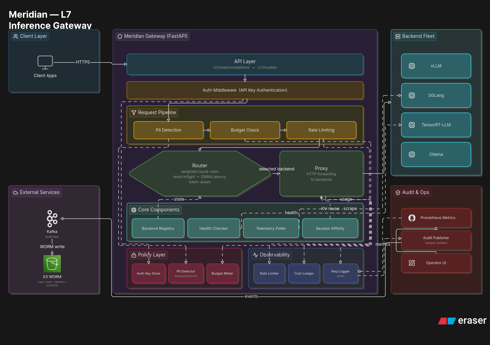

# Meridian

**Latest release: [](https://github.com/IMV-IN/Meridian/releases/latest)** ·  
**Website:** [imv-in.github.io/Meridian](https://imv-in.github.io/Meridian/) · **Quickstart:** [`docs/QUICKSTART.md`](docs/QUICKSTART.md)

Meridian is an **L7 inference gateway** for self-hosted / on-soil LLM fleets. It sits between your apps and OpenAI-compatible backends (vLLM, SGLang, TensorRT-LLM, Ollama, …) and adds **routing, health/failover, multi-tenant controls, and compliance hooks** without changing application code.

It is **not** an inference engine — no GPU scheduling, no KV-cache allocator.

> Think: *nginx for LLM backends, with enterprise controls baked in.*

## Why teams use it

- **Drop-in OpenAI API** — `/v1/chat/completions` (stream + non-stream), `/v1/models`
- **Routing & reliability** — least-inflight, token-aware, EWMA; health checks + failover; **canary rollouts** with error-rate auto-rollback
- **Multi-tenant controls** — API keys → org/team/user; budgets; model allow-lists; rate limits; **dedicated backend pools per tenant** (isolation modes)
- **Key lifecycle API** — create/delete API keys live (`/meridian/keys`), per-key budgets and usage export
- **Compliance hooks** — India PII pack (request path); optional tamper-evident audit; metadata-only logs
- **Cost** — actual `usage` ledger + org-scoped + per-key export (`docs/ENTERPRISE_COST.md`)
- **Ops** — Prometheus, Helm, air-gap packaging, non-root image

Full feature history: [`docs/MILESTONES.md`](docs/MILESTONES.md) · Status: [`docs/ship.md`](docs/ship.md)

## 5-minute quickstart

```bash
git clone https://github.com/IMV-IN/Meridian.git && cd Meridian
docker compose up --build
```

Then (gateway on **http://localhost:8080** — not 9080):

```bash
curl -i http://localhost:8080/v1/chat/completions \
  -H "Content-Type: application/json" \
  -d '{"model":"demo-model","messages":[{"role":"user","content":"Hello!"}]}'
```

Look for **`x-meridian-backend`** (`fast` or `slow`) and **`x-request-id`**.  
Dashboard: http://localhost:8080/ui  

**Details, smoke test, stop/start:** [`docs/QUICKSTART.md`](docs/QUICKSTART.md)

This compose stack is **gateway + 2 mock backends only** (no Kafka).  
Optional Kafka/audit: `docker compose -f docker-compose.kafka-demo.yml up --build` or `docker-compose.audit.yaml`.

## Install without Docker

```bash
python -m venv .venv && source .venv/bin/activate
pip install -e ".[dev]"          # or: pip install -e .

# Point at a config (always MERIDIAN_CONFIG — uppercase)
export MERIDIAN_CONFIG=configs/mock_demo.yaml
# For local mocks, start mock_backend processes first, or use docker compose
# for backends only and point URLs at localhost.

uvicorn meridian.api.main:app --host 0.0.0.0 --port 8080
# CLI helper (sets MERIDIAN_CONFIG):
#   meridian --config configs/local_gpu.yaml
```

Published images: `ghcr.io/imv-in/meridian:0.12.0` / `:latest`

```bash
docker run --rm -p 8080:8080 \
  -v "$(pwd)/configs/mock_demo.yaml:/app/config.yaml:ro" \
  -e MERIDIAN_CONFIG=/app/config.yaml \
  ghcr.io/imv-in/meridian:0.12.0
```
(You’ll still need reachable backends in that config.)

## Real backend (Ollama)

```bash
ollama pull qwen2.5:0.5b && ollama serve
export MERIDIAN_CONFIG=configs/local_gpu.yaml
uvicorn meridian.api.main:app --host 0.0.0.0 --port 8080
```

### Measured real-engine overhead

Meridian v0.12.0 was tested against Ollama 0.31.1 with `qwen2.5:0.5b` on
an RTX 4060 Laptop GPU. All direct and gateway sync/stream checks passed with
zero benchmark errors.

| Concurrency | Requests | Direct p50 | Meridian p50 | p50 delta | RPS change |
|------------:|---------:|-----------:|-------------:|----------:|-----------:|
| 1 | 30 | 174.1 ms | 180.5 ms | +6.4 ms | -3.9% |
| 4 | 40 | 368.5 ms | 375.5 ms | +7.0 ms | -2.2% |
| 8 | 80 | 243.0 ms | 247.2 ms | +4.1 ms | -1.7% |

These are sequential single-host runs, not a cross-row scaling curve. Ollama
GPU warm state and dynamic batching affect absolute latency. See the
[`methodology and raw evidence`](docs/LOAD.md) and
[`reproducible Ollama/vLLM validation`](docs/REAL_ENGINE_VALIDATION.md).

## Documentation map

| Path | Audience |
|------|----------|
| [`docs/QUICKSTART.md`](docs/QUICKSTART.md) | First successful run |
| [`docs/CONFIGURATION.md`](docs/CONFIGURATION.md) | Full config + auth/budgets/PII examples |
| [`docs/DEPLOY.md`](docs/DEPLOY.md) · [`docs/OPS_RUNBOOK.md`](docs/OPS_RUNBOOK.md) | Production |
| [`docs/README.md`](docs/README.md) | **Index of all docs** |
| [`docs/internal/`](docs/internal/) | Pitch, PoC report, v1.0 gate (not product manuals) |

## API (short)

| Endpoint | Description |
|----------|-------------|
| `POST /v1/chat/completions` | Chat (stream + non-stream) |
| `GET /v1/models` | Models |
| `GET /meridian/status` · `/meridian/version` | Ops |
| `GET /metrics` · `/ui` | Prometheus + dashboard |

Proxied responses include `x-request-id` and `x-meridian-backend`.

## Architecture

```
Client → TLS edge → Meridian (auth · policy · route · proxy · finalize)
                  → Backend 1…N (vLLM / SGLang / TensorRT-LLM / Ollama)
```

Detailed diagram (pipeline, core components, policy, observability, audit):



## Development

```bash
pip install -e ".[dev]"
ruff check . && mypy meridian && pytest -q
```

## License

MIT — see [LICENSE](LICENSE).
