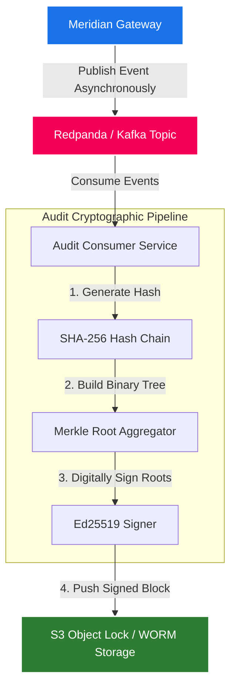

# Meridian: Sovereign AI Inference Gateway
## Enterprise Product Strategy & Sales Proposal Framework

Meridian is a high-performance, L7 AI inference gateway designed to sit between application layers and private/public LLM backends (such as vLLM, SGLang, TensorRT-LLM, Ollama, OpenAI, or Anthropic). 

This document serves as both the **startup product strategy** and a **client-ready enterprise proposal framework** to help pitch, deploy, and scale Meridian in regulated enterprise environments.

---

## Executive Summary

As enterprises transition LLM applications from prototype to production, they face steep regulatory compliance boundaries, extreme GPU cost inefficiencies, and security gaps. Meridian is a **compliance-first** sovereign AI gateway. Rather than a simple convenience proxy, Meridian acts as the regulatory and operational trust layer for enterprise AI. By running on-soil (within private VPCs or physical datacenters), auditing transactions cryptographically, and optimizing GPU scheduling, Meridian enables highly regulated sectors—such as banking, insurance, healthcare, and government—to adopt LLMs safely.

---

## 1. The Regulatory & Operational Reality

### 1.1 The Compliance Mandate
In highly regulated sectors, using public AI endpoints or cross-border cloud platforms introduces existential compliance risks:

*   **RBI Guidelines (India):** Customer transaction logs, KYC details, and all derivative inference payloads must reside on Indian soil. Payment data cannot leave India, even transiently. Standard public endpoints that route queries through global networks violate these regulations.
*   **DPDP Act (2023):** Digital Personal Data Protection Act requires companies to locate, audit, and securely delete citizen PII. Unredacted prompts sent to external models violate data fiduciary duties.
*   **IRDAI IT Framework (2024):** Insurance regulatory data cannot be processed by non-sovereign entities without board-level approval and continuous auditable trails.

> [!IMPORTANT]
> **Market Position:** Meridian is a compliance product first. Regulated enterprises will pay a premium not because open-source models are inherently better, but because using non-sovereign infrastructure introduces unacceptable regulatory and legal liabilities.

### 1.2 Enterprise Scale Analysis
Many system designs overestimate enterprise throughput requirements. A realistic assessment of a mid-sized bank with 20,000 employees shows:
*   **Active Daily Users:** ~3,000 staff members.
*   **Peak Concurrency:** ~300 concurrent sessions.
*   **True Peak In-Flight Requests:** 50 to 150 simultaneous requests.
*   **Throughput Requirements:** For a 30B model generating 300 tokens/request at 80 tokens/sec, true peak load is ~12,000 tokens/sec.
*   **Hardware footprint:** A single 4×H100 node running vLLM with continuous batching handles 8,000–15,000 tokens/sec. Therefore, **1 to 2 GPU nodes** cover a bank’s entire internal AI workload. 
*   **Conclusion:** This is not an internet-scale hyperscaler problem. It is a **distributed systems problem** where the core challenges are isolation, security, and auditing.

---

## 2. Core Features & Capabilities (Currently Built)

The current Meridian release features a production-ready L7 gateway engine built on **FastAPI/Python** that proxies client calls using an asynchronous `httpx` forwarding engine.

```
Incoming Request (/v1/chat/completions)
        │
        ├── Rate Limiter (IP-based Token Bucket)
        │
        ├── Router (Context Estimation: Prompt + Max Tokens Cost)
        │     ├── Strategy: Weighted Round-Robin
        │     ├── Strategy: Least In-Flight Requests
        │     ├── Strategy: EWMA (Latency-aware)
        │     └── Strategy: Token-Aware Scoring (Prefill/Decode weights)
        │
        ├── Dynamic Proxy (httpx streaming / non-streaming forwarding)
        │
        └── Event Egress
              ├── In-Memory Ring Buffer (Recent Requests for UI)
              ├── JSONL Request Logging (Local disk path)
              ├── Prometheus Metrics (/metrics)
              └── Asynchronous Audit Egress (Redpanda / Kafka Publisher)
```

### 2.1 Dynamic L7 Routing Strategies
Meridian supports four backend routing strategies configured globally:
1.  **Weighted Round-Robin:** Routes based on static weights assigned to backend servers.
2.  **Least In-Flight:** Routes to the backend currently executing the fewest active requests.
3.  **EWMA (Exponentially Weighted Moving Average) Latency:** Tracks backend response latencies over time, steering requests away from degraded or slow nodes.
4.  **Token-Aware Routing:** Estimates prompt cost dynamically from content length and maps against the configured `prefill_weight` (estimating prefill time) and `decode_weight` (estimating generation cost based on `max_tokens`). The formula scores backends based on:
    $$\text{Score} = (\text{Backend Inflight Cost} + \text{Request Cost}) \times (\text{EWMA Latency or } 1.0)$$

### 2.2 Telemetry Adapters & Capacity-Aware Penalties
When using the **Token-Aware** routing strategy, Meridian can actively scrape telemetry from backends (e.g. vLLM or SGLang status JSON endpoints) to penalize overloaded nodes.
*   **Queue Penalty:** Multiplies the reported `queue_depth` by `queue_weight`.
*   **Memory Penalty:** Multiplies the reported `gpu_mem_util` (0.0–1.0) by `mem_weight`.
*   These penalties dynamically redirect traffic before the backend becomes unhealthy, smoothing latency spikes.

### 2.3 Live UI Dashboard & Observability
*   **Metrics Endpoint:** Exposes standard Prometheus gauges (like `meridian_backend_healthy`, `meridian_backend_inflight`, and histograms for latency and response status).
*   **Live Dashboard:** Served directly at `/ui` as a single-page app, polling `/meridian/status` and `/meridian/requests` (the gateway's internal 100-request ring buffer) to show node health, active weights, and trace histories in real-time.
*   **Response Headers:** Appends `x-request-id` (`mrdn-xxxx`) and `x-meridian-backend` (identifying the target server) to downstream headers.

---

## 3. Cryptographic Tamper-Evident Audit Pipeline

For regulated sectors, Meridian offers a complete, decoupled compliance audit pipeline. All requests are securely buffered, structured, and archived without injecting latency onto client-facing endpoints.

### 3.1 The Auditing Architecture



*   **Audit Publisher:** The gateway pushes `AuditEvent` messages asynchronously to a Redpanda/Kafka broker using `aiokafka`.
*   **Audit Consumer:** A standalone service reads logs from the queue and performs cryptographic validation:
    1.  **SHA-256 Hash Chain:** Every incoming record is appended to a continuous hash chain, where the current node contains the SHA-256 hash of its payload and the previous node's hash:
        $$\text{Hash}_n = \text{SHA256}(\text{Record}_n \mathbin{\Vert} \text{Hash}_{n-1})$$
    2.  **Binary Merkle Tree:** Periodically, blocks of audit records are gathered to construct a binary Merkle tree.
    3.  **Ed25519 Digital Signatures:** The Merkle root is signed with an Ed25519 private key.
    4.  **S3 Object Lock (WORM):** The signed block and corresponding proofs are stored under a write-once-read-many retention policy in S3-compatible storage.

> [!IMPORTANT]
> **Audit Guarantee:** If an attacker modifies even a single character of a prompt in the audit logs, the downstream hash chain breaks, the Merkle root mismatch is exposed, and the Ed25519 signature fails verification. This provides mathematical proof of compliance for regulatory audits.

---

## 4. Deployment Models for Enterprise Clients

Depending on the client's risk profile and cloud infrastructure maturity, Meridian supports three deployment models:

| Dimension | Managed Cloud (SaaS) | Hybrid VPC (Recommended) | On-Premise / Air-Gapped |
| :--- | :--- | :--- | :--- |
| **Description** | Hosted by Meridian. Easiest setup. | Gateway in client's VPC; control plane hosted by us. | Gateway, message broker, and databases hosted entirely on-premise. |
| **Data Residency** | Shared cloud environment. | 100% inside client’s secure cloud VPC. | 100% inside client's physical datacenter. |
| **Ideal For** | Startups, fast prototyping. | Mid-market, scale-ups, and cloud-native enterprises. | Defense, sovereign government entities, large banks. |
| **Log Storage** | Hosted secure database. | Client-owned S3 / GCS buckets with Object Lock. | On-metal Ceph / MinIO or local secure storage array. |
| **Latency Overhead** | ~10-15ms (cross-cloud network) | < 2ms (within the same VPC) | < 1ms (within the same LAN) |
| **Licensing** | Monthly subscription. | Yearly platform fee + token usage overage. | Long-term contract + annual offline license key. |

---

## 5. Integration & Developer Experience

Meridian is designed for zero developer friction. Applications targeting OpenAI or Anthropic switch to Meridian by simply updating their SDK initialization:

```python
# Transitioning from OpenAI to Meridian in a private VPC
from openai import OpenAI

client = OpenAI(
    base_url="https://meridian-gateway.client-domain.internal/v1",
    api_key="meridian-api-token-xyz" # Authenticated local token
)

response = client.chat.completions.create(
    model="llama3-70b-routing-group", # Request routed through optimal local backend
    messages=[{"role": "user", "content": "Process credit risk prompt."}]
)
```

---

## 6. Product Roadmap & Strategic Extensions

To scale from our core L7 engine to a multi-tenant enterprise suite, the following features are actively prioritized:

*   **PII Detection & Redaction (India-Specific Entity Pack):** Regex and NER models running as high-speed middleware to detect and mask sensitive identifiers:
    *   *Aadhaar:* 12-digit number validated via Verhoeff checksum.
    *   *PAN:* Alphanumeric format `[A-Z]{5}[0-9]{4}[A-Z]`.
    *   *IFSC Code, GSTIN, UPI ID, Voter ID, and phone numbers.*
    *   *Policies:* Block, Redact-and-Replace, Redact-for-Logs, and Audit-Only.
*   **Enterprise RBAC:** Setting up hierarchical organization permissions (Org $\rightarrow$ Department $\rightarrow$ Team $\rightarrow$ User) with strict token budgets, custom API keys, and policy overrides.
*   **Edge Control Plane (Cloudflare Worker Integration):** Shifting authentication, rate limits, and metadata routing to Cloudflare Workers at Mumbai/Chennai/Delhi PoPs to keep the main gateway data-blind.
*   **Prefix Cache Noncing:** Prepending tenant-specific nonces to system prompts within vLLM to isolate KV cache states on shared nodes, preventing cross-tenant side-channel timing leaks.
*   **Open Source Strategy:** Open-sourcing the core Python L7 gateway, telemetry modules, and audit log specification under MIT/Apache licenses to build trust, while keeping billing engines and deployment orchestrators proprietary.

---

## 7. Financial Cost & Commercial Model

### 7.1 Typical Datacenter Infrastructure Cost Model (Monthly)
Leasing bare-metal GPUs in regional Indian datacenters (like Yotta or NxtGen):

| Component | Specification | Estimated Cost (INR / Month) |
| :--- | :--- | :--- |
| **Inference Nodes** | 2× H100 80GB GPUs, 256GB RAM, 2× 100GbE | ₹8,0,000 - ₹12,0,000 |
| **Gateway Node** | 32-core CPU, 128GB RAM | ₹80,000 |
| **Sovereign Storage**| 10TB NVMe storage array | ₹40,000 |
| **Network Egress** | Dedicated 1Gbps link | ₹30,000 |
| **Total Hardware Cost**| | **₹9,50,000 - ₹13,50,000** |

*   **Software Licensing Premium:** Meridian charges a flat software license fee of **₹2,00,000 to ₹3,00,000 / month** on top of the bare-metal cost for the Scale Tier, amounting to ~20-25% of the total infrastructure cost. This is highly cost-competitive compared to global API spends at similar token volumes, while removing regulatory liabilities entirely.

### 7.2 Commercial Licensing Tiers

#### Growth Tier (Mid-Market)
*   *Pricing:* \$1,200 / Month (billed annually).
*   *Details:* Up to 5 backends, basic token rate limiting, Prometheus metrics, and standard failover.

#### Scale Tier (Large Enterprise / Cloud VPC)
*   *Pricing:* \$4,500 / Month + usage overage.
*   *Details:* Unlimited backends, active telemetry monitoring, advanced token-aware routing, Multi-Region routing, PII redaction, 4-hour support SLA.

#### Defense & Sovereign Tier (Air-Gapped / Government)
*   *Pricing:* Custom contract (Starting at \$80,000 / Year).
*   *Details:* Air-gapped Helm chart deployments, offline license validation keys (annual rotations), cryptographically signed audit blocks (MinIO / Object Lock setup), FIPS 140-2 compliance configurations, and dedicated onboarding support.

---

## 8. Sales Pitch Framework & Pilot Roadmap

### Stakeholder Value Matrix
*   **Chief Information Security Officer (CISO):** Focus on data sovereignty. *"Meridian ensures no raw data ever leaves your VPC. Cryptographic WORM logs guarantee zero regulatory risk for audits."*
*   **VP of Engineering / Platform Lead:** Focus on reliability. *"Meridian stabilizes your p99 latencies using token-aware queues and automatic failover metrics scraped directly from vLLM."*
*   **Chief Financial Officer (CFO):** Focus on cost attribution. *"Assign quotas and budgets down to teams and departments, reducing waste and tracking exactly where every Rupee of your AI budget is spent."*

### 4-Week Proof of Concept (PoC) Pilot Plan
*   **Week 1 (VPC Sandbox):** Deploy Meridian within the client's staging VPC. Wire vLLM or Ollama backends and mock external APIs.
*   **Week 2 (Shadowing & Audits):** Mirror a portion of staging traffic through the gateway. Check telemetry logs, trace failures, and audit cost metrics.
*   **Week 3 (Resiliency & Routing):** Enable token-aware and EWMA routing. Measure latency improvements under concurrent traffic.
*   **Week 4 (Verification & Compliance):** Run a compliance check by attempting to alter mock logs, demonstrating how the Merkle hash chain fails immediately to confirm log security. Deliver the final ROI case to transition the PoC into a production license.

---

## 9. Key Open Questions & Future Considerations

1.  **vLLM multi-tenant KV cache isolation:** Further research is needed to determine the exact performance overhead of partitioning GPU memory cache limits. This determines the viability of shared GPU instances for lower tiers.
2.  **Sovereign Model Vendor Agreements:** Securing early weight access and licensing terms with Indian frontier models (e.g., Sarvam AI, Krutrim) creates a powerful, compliant entry barrier.
3.  **Datacenter Partner SLAs:** Establishing clear hardware performance guarantees with providers (Yotta, NxtGen) is required before backing enterprise SLAs.
4.  **Air-gapped verification:** Designing hardware security module (HSM) integrations or TPM-based trust metrics for true offline licensing.
5.  **Fine-Tuning Pipelines:** Evaluating demand for secure, containerized fine-tuning tasks on historical data as a secure addon service in Year 2.
